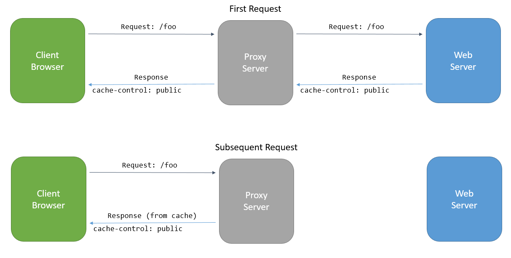

Response Caching
================

By `Steve Smith`_

In this article:
	- `What is Response Caching`_
	- `ResponseCache Attribute`_
	- `Server Caching Behavior`_

`View or download sample from GitHub <https://github.com/aspnet/Docs/tree/1.0.0-rc1/mvc/performance/response-caching/sample>`_.

What is Response Caching
------------------------
*Response caching* refers to specifying cache-related headers on HTTP responses made by ASP.NET MVC actions. These headers specify how you want client and intermediate (proxy) machines to cache responses to certain requests (if at all). This can reduce the number of requests a client or proxy makes to the web server, since future requests for the same action may be served from the client or proxy's cache. In this case, the request is never made to the web server.

The primary HTTP header used for caching is ``cache-control``. The `HTTP specification <https://www.w3.org/Protocols/rfc2616/rfc2616-sec14.html>`_ details many options for this directive. Three common directives are:

public
	Indicates that the response may be cached.

private
	Indicates the response is intended for a single user and **must not** be cached by a shared cache. The response could still be cached in a private cache (for instance, by the user's browser).

no-cache
	Indicates the response **must not** be used by a cache to satisfy any subsequent request (without successful revalidation with the origin server).

.. note:: **Response caching does not cache responses on the web server**. It differs from `output caching <http://www.asp.net/mvc/overview/older-versions-1/controllers-and-routing/improving-performance-with-output-caching-cs>`_, which would cache responses in memory on the server in earlier versions of ASP.NET and ASP.NET MVC. Output caching middleware is planned to be added to ASP.NET MVC 6 in a future release.

Learn more about `Caching in HTTP from the specification <https://www.w3.org/Protocols/rfc2616/rfc2616-sec13.html>`_.

ResponseCache Attribute
-----------------------
The `ResponseCache Attribute <https://github.com/aspnet/Mvc/blob/6.0.0-rc1/src/Microsoft.AspNet.Mvc.Core/ResponseCacheAttribute.cs>`_ is used to specify how a controller action method's headers should be set to control its cache behavior.

Server Caching Behavior
-----------------------
asdf
